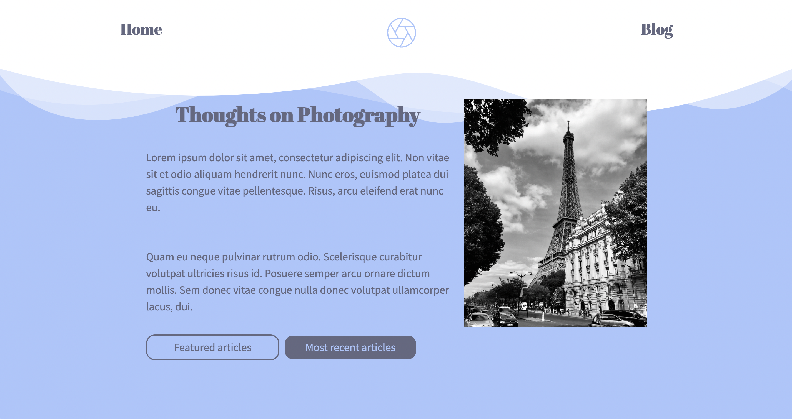
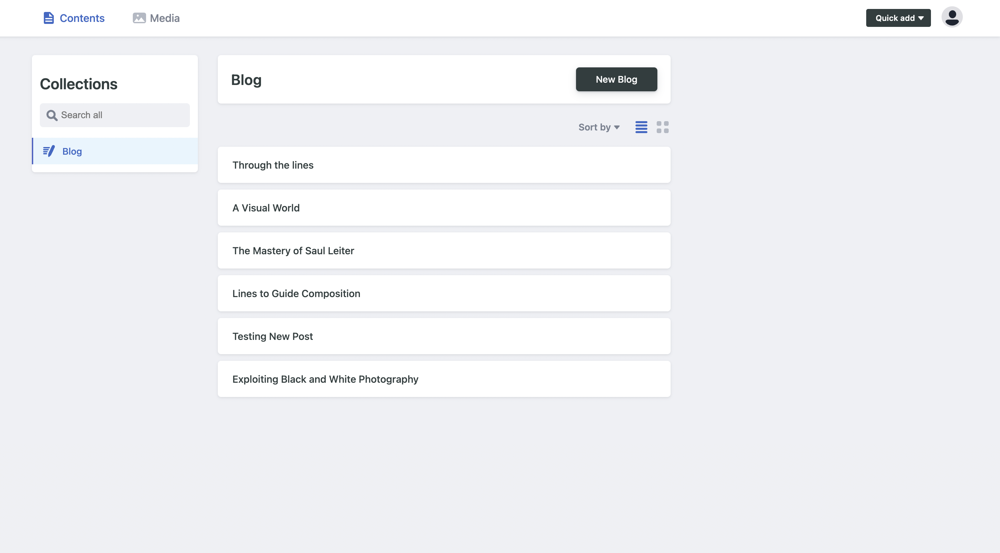
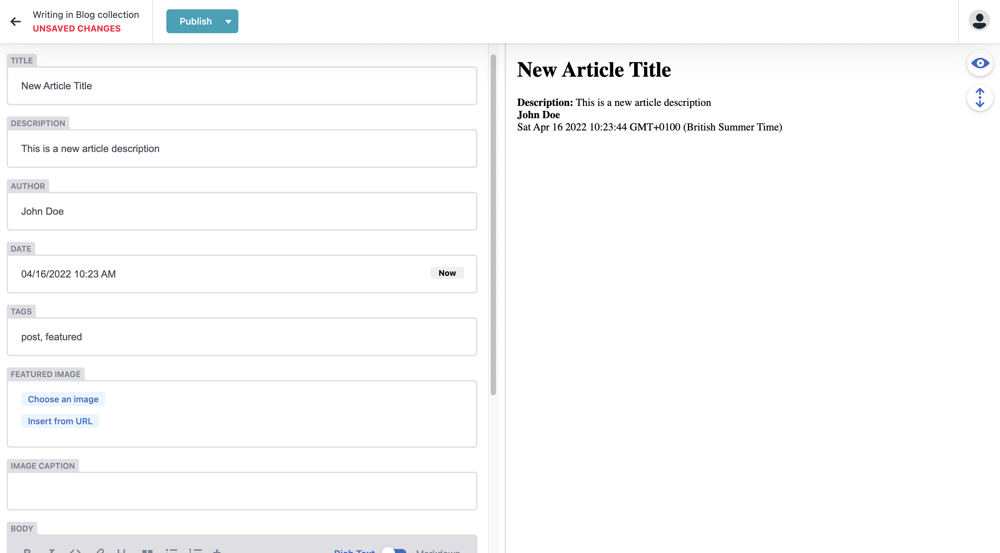

# JAMstack Blog with Eleventy and Netlify CMS

<figure>

<figurecaption>A screenshot of the live site.<figurecaption>
</figure>

## Project Overview

The goal of this project was to create a fast and secure blog using JAMStack. Eleventy was used to create a static site, using Netlify CMS to manage adding, removing, and editing blog posts.

## Design Approach

The fundamental design of this website was to create a page that utilised standardised components as much as possible. In doing so nunjucks and eleventy could be used to integrate multiple components on a range of pages. Standardised components include the base file, header, footer, and article-snippet.

Using the Netlify CMS, implemented in the admin file, a secure admin section of the site was added, enabling any designated user to access the admin interface, thus enabling them to create new, edit existing, and delete old posts on the blog.

<figure>

<figurecaption>A screenshot of the Netlify CMS for managing the content of the blog.</figurecaption>
</figure>

<figure>

<figurecaption>A screenshot of adding a new post via the Netlify CMS.<figurecaption>
</figure>

## Links to Project

### Deployed Site

https://sage-chaja-b1e942.netlify.app/

### GitHub Repo

https://github.com/samueljacobs98/jamstack-blog

### Figma Design

https://www.figma.com/file/gcN5kAkQI6x7RP3AMbsTX4/photography-blog-concept?node-id=0%3A1
